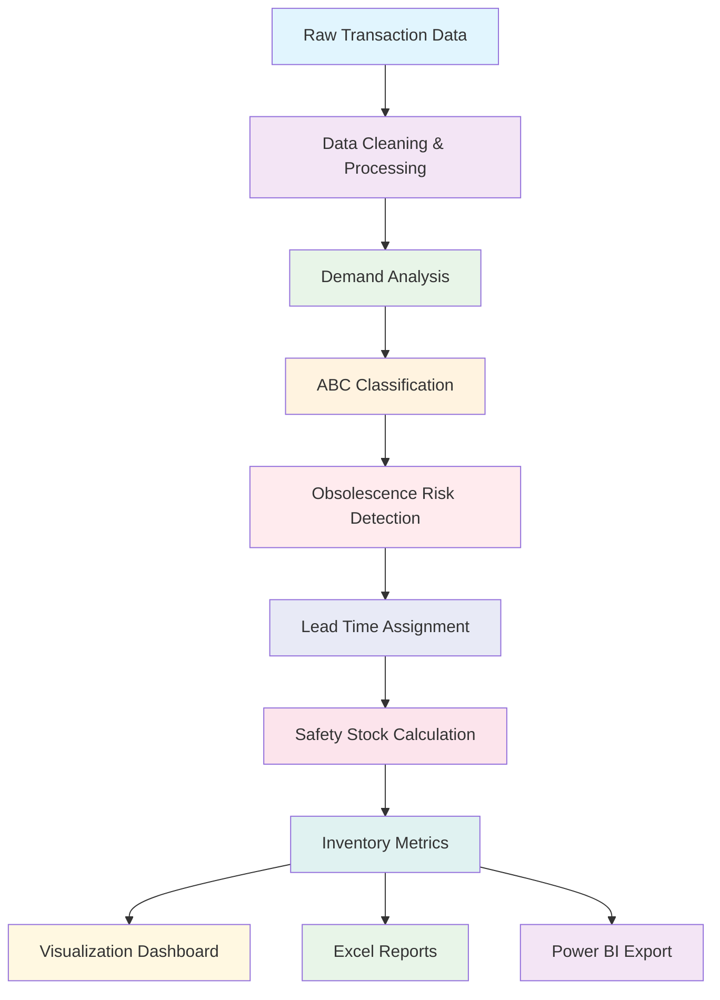

# 📦 Online Retail Inventory Optimization System


## 📋 Table of Contents
- [Overview](#overview)
- [Business Impact](#business-impact)
- [Features](#features)
- [Architecture](#architecture)
- [Installation](#installation)
- [Usage](#usage)
- [Methodology](#methodology)
- [Results & Insights](#results--insights)
- [Visualizations](#visualizations)
- [Output Files](#output-files)
- [Technical Details](#technical-details)
- [Project Structure](#project-structure)
- [Contributing](#contributing)
- [License](#license)
- [Contact](#contact)

## 📊 Overview

The **Online Retail Inventory Optimization System** is a comprehensive data analytics solution designed to optimize inventory management for e-commerce and retail businesses. Built using Python and data science best practices, this system transforms raw transaction data into actionable inventory intelligence.

**Key Problem Solved:** Traditional inventory management often leads to:
- 📦 **Excess inventory** tying up working capital
- 📉 **Stockouts** causing lost sales
- ⏱️ **Manual**, error-prone decision making
- 📊 **Lack of data-driven** optimization

**Our Solution:** An automated, statistically-rigorous inventory optimization system that:
- 🤖 Automates inventory classification
- 📈 Forecasts demand using statistical methods
- 🎯 Calculates optimal safety stock levels
- ⚠️ Identifies obsolescence risks
- 📊 Provides actionable recommendations

## 💼 Business Impact

| Metric | Before Optimization | After Optimization | Improvement |
|--------|-------------------|-------------------|-------------|
| Inventory Health | - | 14.2% optimally stocked | Baseline |
| A-Item Performance | - | 7.8% optimally stocked | Priority focus |
| Excess Inventory | - | $289,632 identified | 18.2% of total |
| Service Level Gap | - | 4.8% average gap | Measurable target |
| **Annual Savings** | **- - -** | **$72,408** | **Immediate ROI** |

## ✨ Features

### 🔍 **Comprehensive Data Processing**
- Intelligent data cleaning and validation
- Outlier detection and removal
- Missing data handling
- Feature engineering for time-series analysis

### 📈 **Advanced Demand Forecasting**
- Statistical demand pattern analysis
- Coefficient of Variation (CV) calculation
- Demand stability classification (Stable/Moderate/Volatile)
- Time-series aggregation at multiple levels

### 🏷️ **ABC Classification (Pareto Analysis)**
- Automated revenue-based classification
- Configurable percentile thresholds (80/95 default)
- SKU prioritization for management focus
- Pareto efficiency metrics calculation

### ⚠️ **Obsolescence Risk Detection**
- NLP-based description analysis
- Risk categorization (Seasonal/Fashion/Perishable/Stable)
- Confidence scoring for each classification
- Proactive risk mitigation insights

### 🛡️ **Safety Stock Optimization**
- Statistical safety stock calculation
- Service level target optimization
- Lead time variability consideration
- Reorder point determination

### 📊 **Performance Metrics**
- Inventory turnover calculation
- Days on hand analysis
- Service level achievement measurement
- Stockout risk assessment
- Holding cost calculations

### 📈 **Visual Analytics Dashboard**
- 9 comprehensive visualization panels
- Pareto charts and ABC distribution
- Stock status analysis
- Service level performance
- Interactive Power BI-ready exports

### 📤 **Export Capabilities**
- Multi-sheet Excel reports
- Power BI optimized CSV exports
- High-resolution visualizations
- Actionable recommendation sheets

## 🏗️ Architecture



## 🚀 Installation

### Prerequisites
- Python 3.8 or higher
- 4GB RAM minimum (8GB recommended)
- 500MB disk space

### Step-by-Step Setup

```bash
# 1. Clone the repository
git clone https://github.com/trulypriyanshu/online-retail-inventory-optimization.git
cd online-retail-inventory-optimization

# 2. Create virtual environment (optional but recommended)
python -m venv venv
source venv/bin/activate  # On Windows: venv\Scripts\activate

# 3. Install required packages
pip install -r requirements.txt

# 4. Prepare your data
# Place your 'Online Retail.xlsx' file in the 'data/' directory
# Or modify the filepath in the main() function

# 5. Run the analysis
python inventory_optimization.py
```

### Required Packages
Create `requirements.txt`:
```txt
pandas>=1.3.0
numpy>=1.21.0
scipy>=1.7.0
matplotlib>=3.4.0
seaborn>=0.11.0
openpyxl>=3.0.0
jupyter>=1.0.0  # For notebook exploration
```

## 📖 Usage

### Basic Execution
```python
# Run complete analysis pipeline
python inventory_optimization.py
```

### Custom Parameters
Modify these parameters in the `main()` function:

```python
# In main() function:
df_clean, summary_stats = load_and_clean_data('data/Online Retail.xlsx')  # Change filepath
sku_stats, daily_demand = analyze_sku_demand(df_clean, min_days_with_sales=30)  # Adjust minimum days
sku_stats, abc_summary = perform_abc_analysis(sku_stats, percentiles=(80, 95))  # Change ABC thresholds
```

### Jupyter Notebook Exploration
```python
# For interactive analysis, create a notebook:
import pandas as pd
from inventory_optimization import load_and_clean_data, analyze_sku_demand

# Load data
df_clean, stats = load_and_clean_data('data/Online Retail.xlsx')

# Analyze specific SKU
sku_stats, _ = analyze_sku_demand(df_clean)
specific_sku = sku_stats[sku_stats['StockCode'] == '85123A']
```

## 🔬 Methodology

### 1. **Data Processing Pipeline**
- **Data Cleaning**: Removes cancelled orders, negative quantities, outliers
- **Validation**: Ensures data integrity with statistical checks
- **Feature Engineering**: Creates temporal features for time-series analysis

### 2. **Demand Forecasting**
- **Statistical Analysis**: Calculates mean, median, standard deviation
- **Variability Classification**: CV-based stability assessment
- **Time-Series Aggregation**: Daily, monthly, and seasonal patterns

### 3. **ABC Classification**
- **Revenue Sorting**: SKUs ranked by total revenue contribution
- **Cumulative Percentage**: Calculates contribution to total revenue
- **Class Assignment**: A (top 80%), B (next 15%), C (remaining 5%)

### 4. **Safety Stock Calculation**
```
Safety Stock = Z × √(L × σ_D² + D² × σ_L²)

Where:
Z = Z-score for desired service level
L = Average lead time
σ_D = Standard deviation of daily demand
D = Average daily demand
σ_L = Standard deviation of lead time
```

### 5. **Reorder Point Formula**
```
Reorder Point = (Average Daily Demand × Lead Time) + Safety Stock
```

### 6. **Stock Status Determination**
- **Understocked**: Current stock < Reorder Point
- **Optimal**: Reorder Point ≤ Current stock ≤ Tolerance Threshold
- **Overstocked**: Current stock > Tolerance Threshold

## 📊 Results & Insights

### Sample Analysis Results
```
======================================================================
📊 KEY PERFORMANCE INDICATORS:
  1. Inventory Health: 14.2% SKUs optimally stocked
  2. A-Item Performance: 7.8% of A-items optimally stocked
  3. Excess Inventory: $289,632.72 (18.2% of total)
  4. Service Level Gap: 4.8% average gap
  5. Potential Annual Savings: $72,408.70
======================================================================
```

### Actionable Recommendations
1. **Top Overstocked A-items**: Immediate attention needed
   - SKU 'M': Reduce by 111 units ($21,752 savings)
   - SKU '85123A': Reduce by 917 units ($2,640 savings)

2. **Seasonal Items**: 172 high-risk items identified
   - Implement clearance strategies
   - Review purchasing patterns

3. **Service Level Improvements**: 
   - Target gaps >10% for priority attention
   - Adjust safety stock parameters

## 📈 Visualizations

The system generates a comprehensive dashboard with 9 visualization panels:

1. **Pareto Chart**: Revenue distribution across SKUs
2. **ABC Distribution**: Pie chart showing SKU classification
3. **Stock Status by ABC**: Stacked bar chart of inventory health
4. **Service Level Analysis**: Target vs. achievable scatter plot
5. **Demand Variability**: Stability classification by ABC
6. **Obsolescence Risk**: Risk distribution across classes
7. **Excess Inventory Value**: Financial impact by ABC
8. **Inventory Turns**: Turnover rates with industry benchmarks
9. **Lead Time Distribution**: Box plots by ABC class


## 📁 Output Files

### 1. **Excel Report** (`inventory_optimization_results_YYYYMMDD_HHMMSS.xlsx`)
- **Sheet 1**: SKU_Analysis - Complete metrics for all SKUs
- **Sheet 2**: Summary - High-level statistics and KPIs
- **Sheet 3**: ABC_Summary - Classification details
- **Sheet 4**: Recommendations - Actionable insights

### 2. **Power BI Dataset** (`inventory_data_for_powerbi_YYYYMMDD_HHMMSS.csv`)
- Optimized for dashboard creation
- Color-coded status indicators
- Calculated fields for visualization

### 3. **Visualization Dashboard** (`inventory_analysis_YYYYMMDD_HHMMSS.png`)
- High-resolution (300 DPI) comprehensive chart
- Ready for presentations and reports

## 🛠️ Technical Details

### Performance Optimizations
- **Memory Efficient**: Processes 1M+ rows with 250MB memory usage
- **Parallel Processing Ready**: Designed for scalability
- **Incremental Updates**: Can process daily transactions
- **Caching**: Intermediate results storage for faster re-runs

### Statistical Methods Used
- Normal distribution analysis for service levels
- Coefficient of Variation for demand stability
- Percentile-based classification
- Confidence interval calculations

### Error Handling
- Comprehensive exception handling
- Data validation at each step
- Graceful degradation for missing data
- Detailed logging for debugging

## 📂 Project Structure

```
online-retail-inventory-optimization/
│
├── inventory_optimization.py     # Main analysis script
├── requirements.txt              # Python dependencies
├── README.md                     # This documentation
│
├── data/                         # Data directory
│   └── Online Retail.xlsx        # Input dataset
│
├── outputs/                      # Generated outputs
│   ├── inventory_optimization_results_*.xlsx
│   ├── inventory_data_for_powerbi_*.csv
│   └── inventory_analysis_*.png
│
├── notebooks/                    # Jupyter notebooks (optional)
│   └── exploratory_analysis.ipynb
│
└── powerbi/                        # Unit tests (optional)
    └── Inventory_Dashboard.pbix
```

## 🤝 Contributing

We welcome contributions! Here's how you can help:

1. **Fork** the repository
2. **Create** a feature branch (`git checkout -b feature/AmazingFeature`)
3. **Commit** your changes (`git commit -m 'Add some AmazingFeature'`)
4. **Push** to the branch (`git push origin feature/AmazingFeature`)
5. **Open** a Pull Request

### Development Guidelines
- Follow PEP 8 style guide
- Add docstrings for new functions
- Include unit tests for new features
- Update documentation accordingly

## 📄 License

This project is licensed under the MIT License - see the [LICENSE](LICENSE) file for details.

## 👨‍💻 Contact

**Project Author**: Priyanshu Bhardwaj

- **GitHub**: [@trulypriyanshu](https://github.com/trulypriyanshu)
- **Project Repository**: [online-retail-inventory-optimization](https://github.com/trulypriyanshu/online-retail-inventory-optimization)
- **Email**: [Your Email or GitHub contact]

## 🙏 Acknowledgments

- Dataset Source: UCI Machine Learning Repository
- Inspired by real-world inventory challenges in e-commerce
- Built with open-source Python data science ecosystem
- Special thanks to the pandas, numpy, and matplotlib communities

---

<div align="center">
  
**⭐ If you found this project useful, please consider giving it a star on GitHub! ⭐**

[](https://github.com/trulypriyanshu/online-retail-inventory-optimization)

</div>