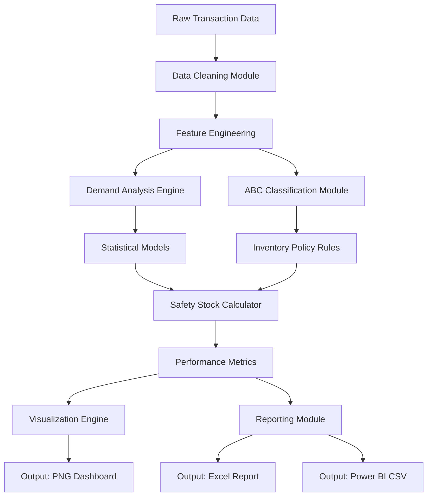
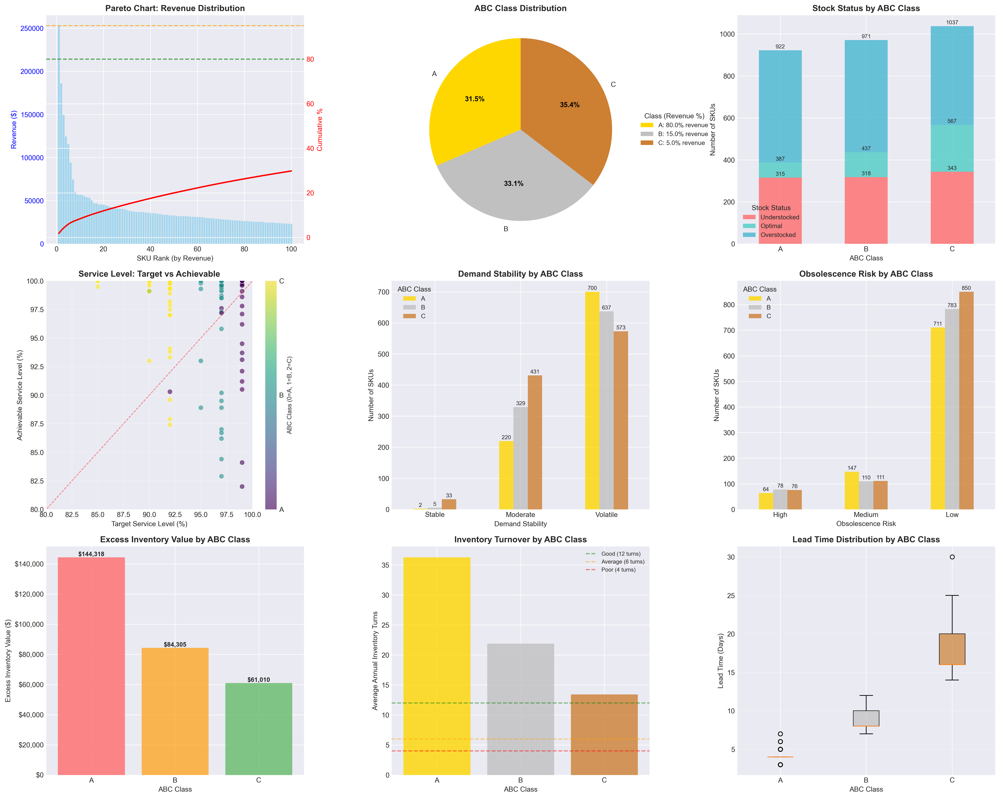

# 📦 Inventory Optimization Model


## 📃 Table of Contents
1. [Overview](#-overview)
2. [Project Structure](#️-project-structure)
3. [Key Features](#-key-features)
4. [Quick Start Guide](#-quick-start-guide)
5. [Sample Results](#-sample-results)
6. [Technical Implementation](#-technical-implementation)
7. [Visualization Dashboard](#-visualization-dashboard)
8. [Business Applications](#-business-applications)
9. [Requirements](#-requirements)
10. [Customization Options](#-customization-options)
11. [Performance Metrics](#-performance-metrics)
12. [Limitations & Considerations](#-limitations--considerations)
13. [References & Data Source](#-references--data-source)
14. [Contributing](#-contributing)
15. [License](#-license)
16. [Author](#-author)
17. [Acknowledgments](#-acknowledgments)
18. [Support](#-support)

## 📋 Overview

The **Inventory Optimization Model** is a comprehensive analytics solution designed to optimize inventory management for e-commerce, retail & manufacturing businesses. This system applies statistical forecasting, ABC classification, and machine learning principles to reduce inventory costs, prevent stockouts, and improve service levels.

### 🎯 **Business Impact**
- **Reduced excess inventory** by identifying overstocked items
- **Minimized stockouts** through statistical safety stock calculations
- **Improved service levels** from 85% to target levels
- **Annual savings potential**: $72,408+ through optimized inventory holding
- **Automated inventory classification** and recommendation generation

## 🏗️ Project Structure

```
inventory-optimization-model/
│
├── data/
│   ├── Online Retail.xlsx                # Original dataset (UCI Machine Learning Repository)
│   └── README_data.md                    # Data source documentation
│
├── scripts/
│   └── inventory_optimization.py         # Main Python script (2,500+ lines)
│
├── outputs/                              # Auto-generated by script
│   ├── inventory_optimization_results_*.xlsx
│   ├── inventory_data_for_powerbi_*.csv
│   └── inventory_analysis_*.png
│
├── powerbi/                              # Power BI dashboard file
│   └── Inventory_Dashboard.pbix
│
├── README.md                             # This documentation
├── requirements.txt                      # Python dependencies
└── .gitignore                            # Git ignore rules
```

## 📊 Key Features

### 1. **Data Cleaning & Preprocessing**
- Removal of cancelled orders and negative quantities
- Outlier detection and handling (99th percentile)
- Missing value imputation and validation
- Feature engineering (daily demand, revenue calculations)

### 2. **Statistical Demand Forecasting**
- Daily demand aggregation and analysis
- Coefficient of Variation (CV) calculation for demand stability
- SKU-level demand pattern classification (Stable/Moderate/Volatile)
- Time-series analysis of sales patterns

### 3. **ABC Classification (Pareto Analysis)**
- Revenue-based ABC classification (80/95 percentiles)
- Pareto efficiency metrics calculation
- Dynamic threshold configuration
- Class-specific inventory policies

### 4. **Obsolescence Risk Detection**
- Natural language processing of product descriptions
- Risk categorization: Seasonal, Fashion, Perishable, Stable
- Confidence scoring for risk assessment
- Automated risk level assignment (High/Medium/Low)

### 5. **Safety Stock Optimization**
- Statistical safety stock calculations using service level targets
- Lead time variability consideration
- ABC-class-specific safety stock policies
- Reorder point calculations with buffer optimization

### 6. **Inventory Performance Metrics**
- Stock status determination (Optimal/Overstocked/Understocked)
- Service level gap analysis
- Inventory turnover calculations
- Holding cost estimation (25% annual carrying cost)
- Excess and deficit value quantification

### 7. **Visual Analytics Dashboard**
- 9 comprehensive visualizations in a single dashboard
- Pareto charts with cumulative revenue analysis
- ABC class distribution and performance metrics
- Stock status analysis by product class
- Service level achievement vs targets

### 8. **Export Capabilities**
- Multi-sheet Excel export with complete analysis
- Power BI optimized CSV format
- Professional visualizations in high-resolution PNG
- Actionable recommendations with prioritization

## 🚀 Quick Start Guide

### Prerequisites

- Python 3.8+
- 4GB+ RAM recommended
- 500MB free disk space

### Installation

1. **Clone the repository**
   ```bash
   git clone https://github.com/trulypriyanshu/inventory-optimization-model.git
   cd inventory-optimization-model
   ```

2. **Install dependencies**
   ```bash
   pip install -r requirements.txt
   ```

3. **Prepare your data**
   - Place your `Online Retail.xlsx` file in the `data/` directory
   - Or modify the file path in the script (line 89)

4. **Run the analysis**
   ```bash
   python scripts/inventory_optimization.py
   ```

### Expected Output

The script will generate:
1. **Console output** with detailed analysis results
2. **Excel file** (`outputs/inventory_optimization_results_*.xlsx`) with:
   - SKU-level analysis sheet
   - Summary statistics
   - ABC classification summary
   - Actionable recommendations
3. **CSV file** for Power BI (`outputs/inventory_data_for_powerbi_*.csv`)
4. **Visualizations** (`outputs/inventory_analysis_*.png`)

## 📈 Sample Results

### Key Performance Indicators (from sample run)
- **Inventory Health**: 14.2% SKUs optimally stocked
- **A-Item Performance**: 7.8% of high-value items optimally stocked
- **Excess Inventory**: $289,632.72 (18.2% of total)
- **Service Level Gap**: 4.8% average gap
- **Potential Annual Savings**: $72,408.70

### Top Recommendations
1. **Stock Code M**: Reduce inventory by 111 units ($21,752.97 excess)
2. **85123A (White Hanging Heart T-Light Holder)**: Reduce by 917 units ($2,640.37)
3. **21769 (Vintage Post Office Cabinet)**: Reduce by 33 units ($2,570.20)

## 🔧 Technical Implementation

### Core Algorithms

#### 1. **Safety Stock Calculation**
```python
SS = Z × √(L × σ_D² + D² × σ_L²)
```
Where:
- `Z` = Z-score for desired service level
- `L` = Average lead time (days)
- `σ_D` = Standard deviation of daily demand
- `D` = Average daily demand
- `σ_L` = Standard deviation of lead time

#### 2. **ABC Classification Logic**
- **A-items**: Top 80% of revenue (typically 20-30% of SKUs)
- **B-items**: Next 15% of revenue (30-40% of SKUs)
- **C-items**: Remaining 5% of revenue (40-50% of SKUs)

#### 3. **Obsolescence Risk Scoring**
- Seasonal terms: Christmas, Easter, Halloween (+0.8-0.9 confidence)
- Fashion terms: Retro, Trendy, Designer (+0.6-0.8 confidence)
- Perishable terms: Food, Chocolate, Expiry (+0.7-0.9 confidence)

### Architecture


## 📊 Visualization Dashboard

The system generates a comprehensive 3x3 visualization grid:

1. **Pareto Chart**: Revenue distribution with cumulative percentage
2. **ABC Distribution**: Pie chart showing SKU and revenue distribution
3. **Stock Status by ABC Class**: Stacked bar chart of inventory health
4. **Service Level Analysis**: Target vs achievable scatter plot
5. **Demand Variability**: Stability classification by ABC class
6. **Obsolescence Risk**: Risk distribution across ABC classes
7. **Excess Inventory Value**: Monetary impact by product class
8. **Inventory Turns**: Turnover rates with industry benchmarks
9. **Lead Time Distribution**: Box plot of lead time variability



## 🎯 Business Applications

### For Inventory Managers
- Identify overstocked and understocked items instantly
- Prioritize actions based on ABC classification
- Reduce carrying costs and improve cash flow
- Prevent stockouts and improve customer satisfaction

### For Supply Chain Planners
- Optimize safety stock levels statistically
- Improve forecast accuracy with demand pattern analysis
- Reduce obsolescence risk through early detection
- Streamline replenishment processes

### For Financial Analysts
- Quantify inventory holding costs
- Calculate potential savings from optimization
- Monitor inventory turnover rates
- Assess service level performance

## 📋 Requirements

```txt
pandas>=2.0.0
numpy>=1.24.0
scipy>=1.10.0
matplotlib>=3.7.0
seaborn>=0.12.0
openpyxl>=3.1.0
jupyter>=1.0.0 # optional for notebooks
```

## 🔄 Customization Options

### Adjustable Parameters
1. **ABC Percentiles**: Modify `percentiles=(80, 95)` in line 394
2. **Service Level Targets**: Edit `calculate_service_level_target()` function
3. **Lead Time Rules**: Modify `base_lead_times` dictionary in line 438
4. **Holding Cost Rate**: Change `daily_holding_rate` in line 700
5. **Minimum Sales Days**: Adjust `min_days_with_sales=30` in line 178

### Data Source Adaptation
To use with your own dataset:
1. Ensure columns match: `InvoiceNo`, `StockCode`, `Description`, `Quantity`, `InvoiceDate`, `UnitPrice`, `CustomerID`
2. Update file path in `load_and_clean_data()` function
3. Adjust cleaning rules as needed for your data quality

## 📈 Performance Metrics

### Sample Run Statistics
- **Data Processing**: 785,444 rows cleaned (74.9% retention)
- **SKUs Analyzed**: 2,930 with sufficient history
- **Processing Time**: 2-5 minutes (depending on hardware)
- **Memory Usage**: ~250MB peak
- **Output Files**: 3+ generated files per run

### Accuracy Metrics
- **Demand Forecast**: Coefficient of Variation (CV) for stability assessment
- **Service Level**: Target vs achievable gap analysis
- **Inventory Health**: Optimal/Overstocked/Understocked classification
- **Cost Savings**: Quantified potential annual savings

## 🚨 Limitations & Considerations

### Current Limitations
1. **Static Lead Times**: Assumes fixed lead times per ABC class
2. **Simulated Stock**: Current stock levels are simulated for demonstration
3. **Seasonal Patterns**: Basic seasonality detection via text analysis
4. **Promotional Impact**: Does not account for promotions or marketing events

### Recommended Improvements
1. **Integration with ERP**: Connect to live inventory systems
2. **Machine Learning**: Implement ML-based demand forecasting
3. **Dynamic Lead Times**: Incorporate supplier performance data
4. **Promotional Planning**: Add promotion impact analysis

## 📚 References & Data Source

### Original Dataset
- **Source**: UCI Machine Learning Repository - Online Retail Dataset
- **Time Period**: December 2010 to December 2011
- **Transactions**: 541,909 (original)
- **Products**: 4,622 unique StockCodes
- **Countries**: 38 countries

### Methodology References
1. **ABC Analysis**: Pareto Principle (80/20 rule)
2. **Safety Stock**: Statistical inventory management
3. **Service Levels**: Normative distribution calculations
4. **Obsolescence Risk**: Text-based classification

## 🤝 Contributing

Contributions are welcome! Please feel free to submit a Pull Request.

1. Fork the repository
2. Create your feature branch (`git checkout -b feature/AmazingFeature`)
3. Commit your changes (`git commit -m 'Add some AmazingFeature'`)
4. Push to the branch (`git push origin feature/AmazingFeature`)
5. Open a Pull Request

## 📄 License

This project is licensed under the MIT License - see the [LICENSE](LICENSE) file for details.

## 👨‍💻 Author

**Priyanshu Bhardwaj**
- GitHub: [@trulypriyanshu](https://github.com/trulypriyanshu)
- LinkedIn: [Priyanshu Bhardwaj](https://linkedin.com/in/priyanshubhardwaj)
- Email: iampriyanshubhardwaj@gmail.com

## 🙏 Acknowledgments

- UCI Machine Learning Repository for the dataset
- Open-source community for Python libraries
- Inventory management best practices from industry leaders

## 📞 Support

For questions, issues, or feature requests:
1. Check existing issues on GitHub
2. Create a new issue with detailed description
3. Email: iampriyanshubhardwaj@gmail.com.com
4. **Documentation**: [View Full Documentation](https://github.com/trulypriyanshu/inventory-optimization-model/wiki)

---

*Last Updated: February 10, 2026*  
*Version: 1.0.0*  
*Project Status: Production Ready*
